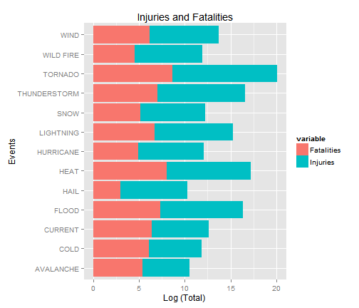
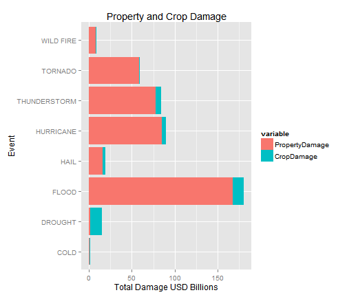

Reproducible Research Peer Assessment 2: U.S. National Oceanic and Atmospheric Administration's (NOAA) Storm Database Analysis 
=====================================================================

# Sysnopsis

Storms and other severe weather events can cause both public health and economic problems for communities and municipalities. Many severe events can result in fatalities, injuries, and property damage, and preventing such outcomes to the extent possible is a key concern.

In this report we analyse the U.S National Oceanic and Atmostpheric Administration's (NOAA) Storm database to investigate which weather events are most harmful.

By the end of this analysis you'll notice that tornado is the worst weather event to threaten population health for both injuries and fatalities. Heat is second as far as its impact on fatalities is concerned and thunderstorm is second as far as injuries is concerned.

In regards to economic damage, the damage to property is higher than the damage to crops. Of all the weather events, flood by far, has the most severe economic impact. 

# Data Processing

## Packages used in this analysis


```r
library(ggplot2)
library(reshape2)
library(plyr)
```


We first read the NOAA Storm data into R: 


```r
# If the file doesn't exist in the working directory, download it and store
# it into the variable StormData
filename <- "repdata-data-StormData.csv.bz2"
if (!file.exists("repdata-data-StormData")) {
    fileurl <- "http://d396qusza40orc.cloudfront.net/repdata%2Fdata%2FStormData.csv.bz2"
    download.file(fileurl, filename, "auto")
}
StormData <- read.csv(filename)
```


### Now that we have our data loaded into R. Let's do some data munging on population health and economic damage. 

## 1. Population Health

For population health, we'll aggregate the number of fatalities and injuries per weather event. This will begin to answer of most basic question: Which weather events are most harmful on communities and municiplaities?


```r
fatalities <- ddply(StormData, "EVTYPE", summarize, Fatalities = sum(FATALITIES, 
    na.rm = T))
injuries <- ddply(StormData, "EVTYPE", summarize, Injuries = sum(INJURIES, na.rm = T))
harmdata <- merge(fatalities, injuries, by = "EVTYPE")
```


Let's munge on the data some more here since some data quality issues exist that will compromise the quality of our analysis. The dataset has several event types that are the same but classified with different names. There are several instances where variables names are misspelled also. In order to take care of this, we'll create a function that does some clean-up work for us.


```r
cleanHarm <- function(param) {
    subtotalFatalities <- sum(harmdata[grepl(param, harmdata$EVTYPE, ignore.case = T), 
        2])
    subtotalInjuries <- sum(harmdata[grepl(param, harmdata$EVTYPE, ignore.case = T), 
        3])
    regex <- grepl(param, harmdata$EVTYPE, ignore.case = T)
    total <- sum(harmdata[regex, 2])
    harmdata$EVTYPE <- as.character(harmdata$EVTYPE)
    harmdata <- subset(harmdata, !grepl(param, harmdata$EVTYPE, ignore.case = T))
    newRow <- data.frame(EVTYPE = param, Fatalities = subtotalFatalities, Injuries = subtotalInjuries)
    harmdata <- rbind(harmdata, newRow)
    return(harmdata)
}

harmdata <- cleanHarm("HEAT")
harmdata <- cleanHarm("TORNADO")
harmdata <- cleanHarm("FLOOD")
harmdata <- cleanHarm("HAIL")
harmdata <- cleanHarm("SNOW")
harmdata <- cleanHarm("CURRENT")
harmdata <- cleanHarm("COLD")
harmdata <- cleanHarm("TORM")
harmdata <- cleanHarm("TSTM")
harmdata <- cleanHarm("TORM|TSTM")
harmdata[nrow(harmdata), 1] <- "THUNDERSTORM"
harmdata <- cleanHarm("AVALAN")
harmdata[nrow(harmdata), 1] <- "AVALANCHE"
harmdata <- cleanHarm("WIND")
harmdata <- cleanHarm("HURRICANE")
harmdata <- cleanHarm("WINTER WEATHER")
harmdata <- cleanHarm("WILD")
harmdata[nrow(harmdata), 1] <- "WILD FIRE"
harmdata <- cleanHarm("LIGHT")
harmdata[nrow(harmdata), 1] <- "LIGHTNING"
harmdata <- cleanHarm("DUST DEVIL")
harmdata <- cleanHarm("ROAD")
harmdata[nrow(harmdata), 1] <- "ICE ON ROAD"
harmdata <- cleanHarm("ICE")
harmdata <- cleanHarm("FOG")
harmdata <- cleanHarm("HYPOTHERMIA")
harmdata <- cleanHarm("LANDSLIDE")
harmdata <- cleanHarm("MUDSLIDE")
harmdata <- cleanHarm("SURF")
harmdata[nrow(harmdata), 1] <- "HAZARDOUS SURF"
harmdata <- cleanHarm("WARM")
harmdata[nrow(harmdata), 1] <- "WARM WEATHER"
harmdata <- cleanHarm("MARINE")
harmdata[nrow(harmdata), 1] <- "MARINE ACCIDENT"
harmdata <- cleanHarm("WARM")
harmdata <- cleanHarm("low|cold")
harmdata[nrow(harmdata), 1] <- "COLD"
harmdata <- cleanHarm("RAINFALL|HEAVY RAIN")
harmdata[nrow(harmdata), 1] <- "HEAVY RAIN"
```


The fatalities total were seperated from the injuries total in the final dataset. So now, we merge the the top 10 causes of injuries with the top 10 causes of fatalities. 


```r
MostHarmful <- harmdata[harmdata$EVTYPE %in% arrange(harmdata, desc(Injuries))[1:10, 
    1] | harmdata$EVTYPE %in% arrange(harmdata, desc(Fatalities))[1:10, 1], 
    ]
MostHarmful_melt <- melt(MostHarmful, id = "EVTYPE")
```


So most of the work we've done so far is for population health. Let's investigate economic damage.

## 2. Economic Damage 

Let's continue to munge. Our first order of business here is to convert some of these odd notations that are in charater (such as M) to the respective numercial notation and remove the ones that aren't very helful ('?','+','-')


```r
StormData$PROPDMGEXP <- mapvalues(StormData$PROPDMGEXP, from = c("B", "b", "M", 
    "m", "K", "k", "H", "h"), to = c("9", "9", "6", "6", "3", "3", "2", "2"), 
    warn_missing = F)
StormData$CROPDMGEXP <- mapvalues(StormData$CROPDMGEXP, from = c("B", "b", "M", 
    "m", "K", "k", "H", "h"), to = c("9", "9", "6", "6", "3", "3", "2", "2"), 
    warn_missing = F)
StormData <- subset(StormData, StormData$PROPDMGEXP != "+" & StormData$PROPDMGEXP != 
    "-" & StormData$PROPDMGEXP != "?")
StormData <- subset(StormData, StormData$CROPDMGEXP != "+" & StormData$CROPDMGEXP != 
    "-" & StormData$CROPDMGEXP != "?")
```


Now, let's calculate and aggregate the damage value for properties and crops per weather event.


```r
dataPropDmg <- ddply(StormData, "EVTYPE", summarize, PropertyDamage = sum(PROPDMG * 
    10^as.numeric(as.character(PROPDMGEXP)), na.rm = T))
dataCropDmg <- ddply(StormData, "EVTYPE", summarize, CropDamage = sum(CROPDMG * 
    10^as.numeric(as.character(CROPDMGEXP)), na.rm = T))
damage <- merge(dataPropDmg, dataCropDmg, by = "EVTYPE")
```


Earlier when working through the Population Health portion of the dataset. We had to do some preprocessing 
in order for the data to maintain some level of integrity. The dataset has several event types that are the same but classified with different names. There are several instances where these are misspelled also. In order to take care of this, we'll create a function that does some clean-up work for us.


```r
cleanDamage <- function(arg) {
    subtotalProp <- sum(damage[grepl(arg, damage$EVTYPE, ignore.case = T), 2])
    subtotalCrop <- sum(damage[grepl(arg, damage$EVTYPE, ignore.case = T), 3])
    regex <- grepl(arg, damage$EVTYPE, ignore.case = T)
    total <- sum(damage[regex, 2])
    damage$EVTYPE <- as.character(damage$EVTYPE)
    damage <- subset(damage, !grepl(arg, damage$EVTYPE, ignore.case = T))
    newRow <- data.frame(EVTYPE = arg, PropertyDamage = subtotalProp, CropDamage = subtotalCrop)
    damage <- rbind(damage, newRow)
    return(damage)
}

damage <- cleanDamage("HEAT")
damage <- cleanDamage("TORNADO")
damage <- cleanDamage("FLOOD")
damage <- cleanDamage("HAIL")
damage <- cleanDamage("SNOW")
damage <- cleanDamage("CURRENT")
damage <- cleanDamage("COLD")
damage <- cleanDamage("TORM")
damage <- cleanDamage("TSTM")
damage <- cleanDamage("TORM|TSTM")
damage[nrow(damage), 1] <- "THUNDERSTORM"
damage <- cleanDamage("AVALAN")
damage[nrow(damage), 1] <- "AVALANCHE"
damage <- cleanDamage("WIND")
damage <- cleanDamage("HURRICANE")
damage <- cleanDamage("WINTER WEATHER")
damage <- cleanDamage("WILD")
damage[nrow(damage), 1] <- "WILD FIRE"
damage <- cleanDamage("LIGHT")
damage[nrow(damage), 1] <- "LIGHTNING"
damage <- cleanDamage("DUST DEVIL")
damage <- cleanDamage("ROAD")
damage[nrow(damage), 1] <- "ICE ON ROAD"
damage <- cleanDamage("ICE")
damage <- cleanDamage("FOG")
damage <- cleanDamage("HYPOTHERMIA")
damage <- cleanDamage("LANDSLIDE")
damage <- cleanDamage("MUDSLIDE")
damage <- cleanDamage("SURF")
damage[nrow(damage), 1] <- "HAZARDOUS SURF"
damage <- cleanDamage("WARM")
damage[nrow(damage), 1] <- "WARM WEATHER"
damage <- cleanDamage("MARINE")
damage[nrow(damage), 1] <- "MARINE ACCIDENT"
damage <- cleanDamage("WARM")
damage <- cleanDamage("low|cold")
damage[nrow(damage), 1] <- "COLD"
damage <- cleanDamage("RAINFALL|HEAVY RAIN")
damage[nrow(damage), 1] <- "HEAVY RAIN"
```


Finally, let's merge the 7 events that cause most of the damage. In addition we'll rescale the values to USD Billions.


```r
MostDamage <- damage[damage$EVTYPE %in% arrange(damage, desc(PropertyDamage))[1:6, 
    1] | damage$EVTYPE %in% arrange(damage, desc(CropDamage))[1:6, 1], ]
MostDamage_melt <- melt(MostDamage, id = "EVTYPE")
MostDamage_melt$value <- MostDamage_melt$value/(10^9)
```


# Results

As we stated in the synopsis above, Tornadoes are both the highest cause of injuries and fatalities. Heat is second as far as its impact on fatalities is concerned and thunderstorm is second as far as injuries is concerned.Let's look at some of the conlusing results of this analysis by the charts below. 


```r
arrange(MostHarmful, EVTYPE)
```

```
##          EVTYPE Fatalities Injuries
## 1     AVALANCHE        225      170
## 2          COLD        443      320
## 3       CURRENT        577      529
## 4         FLOOD       1525     8604
## 5          HAIL         20     1467
## 6          HEAT       3138     9224
## 7     HURRICANE        133     1328
## 8     LIGHTNING        817     5231
## 9          SNOW        169     1166
## 10 THUNDERSTORM       1148    13659
## 11      TORNADO       5661    91407
## 12    WILD FIRE         90     1606
## 13         WIND        469     1896
```


```r
g <- ggplot(MostHarmful_melt, aes(EVTYPE, log(value), fill = variable)) + geom_bar(stat = "identity") + 
    coord_flip()
g <- g + xlab("Events") + ylab("Log (Total) ") + labs(title = "Injuries and Fatalities")
print(g)
```

 


From the economic damage perspective, damage to property is higher than the damage to crops. The most damaging weather event is flood when considering both properties and crops or when analysing only properties. To crops, the worst weather event is drought. 


```r
arrange(MostDamage, EVTYPE)
```

```
##         EVTYPE PropertyDamage CropDamage
## 1         COLD      2.459e+08  1.417e+09
## 2      DROUGHT      1.046e+09  1.397e+10
## 3        FLOOD      1.682e+11  1.238e+10
## 4         HAIL      1.602e+10  3.112e+09
## 5    HURRICANE      8.466e+10  5.505e+09
## 6 THUNDERSTORM      7.752e+10  6.961e+09
## 7      TORNADO      5.860e+10  4.175e+08
## 8    WILD FIRE      8.492e+09  4.028e+08
```


```r
g <- ggplot(MostDamage_melt, aes(EVTYPE, value, fill = variable)) + geom_bar(stat = "identity")
g <- g + xlab("Event") + ylab("Total Damage USD Billions") + labs(title = "Property and Crop Damage") + 
    coord_flip()
print(g)
```

 


